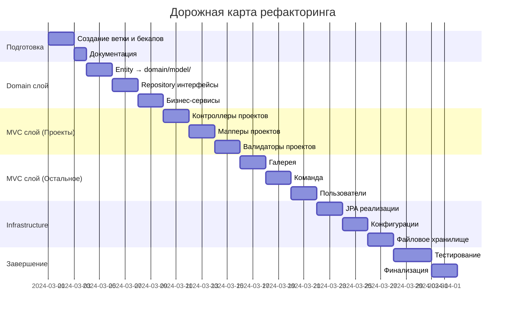

# 🏗️ РЕФАКТОРИНГ АРХИТЕКТУРЫ — COMMUNITY CMS

**🔖 Идентификатор:** `REFACTOR-ARCH-001`  
**📌 Версия:** `1.0.0`  
**📅 Дата создания:** `[ДД.ММ.ГГГГ]`  
**👤 Автор:** `[ВАШЕ ИМЯ]`  
**🌿 Ветка:** `refactor/architecture-cleanup`  
**🎯 Целевая ветка:** `main`  
**📊 Статус:** `🟡 В РАБОТЕ`

---

## 📋 СОДЕРЖАНИЕ

1. [📖 Краткое описание](#-краткое-описание)
2. [🎯 Цели и задачи](#-цели-и-задачи)
3. [📁 Область применения](#-область-применения)
4. [⏳ Сроки и этапы](#-сроки-и-этапы)
5. [🏛️ Целевая архитектура](#️-целевая-архитектура)
    - [5.1 Диаграмма слоев](#51-диаграмма-слоев)
    - [5.2 Детальная структура](#52-детальная-структура)
6. [🔧 Подробный план работ](#-подробный-план-работ)
    - [6.1 Этап 1: Подготовка](#61-этап-1-подготовка)
    - [6.2 Этап 2: Domain слой](#62-этап-2-domain-слой)
    - [6.3 Этап 3: MVC слой — Проекты](#63-этап-3-mvc-слой--проекты)
    - [6.4 Этап 4: MVC слой — Остальные модули](#64-этап-4-mvc-слой--остальные-модули)
    - [6.5 Этап 5: Infrastructure слой](#65-этап-5-infrastructure-слой)
    - [6.6 Этап 6: Завершение](#66-этап-6-завершение)
7. [✅ Критерии приемки](#-критерии-приемки)
8. [⚠️ Риски и митигация](#️-риски-и-митигация)
9. [🛠️ Инструменты и команды](#️-инструменты-и-команды)
10. [📊 Трекер прогресса](#-трекер-прогресса)
11. [📝 Приложения](#-приложения)

---

## 📖 КРАТКОЕ ОПИСАНИЕ

> **Рефакторинг текущей "плоской" архитектуры проекта в многослойную (layered architecture) для улучшения поддерживаемости, тестируемости и подготовки к масштабированию.**

**Текущее состояние:**
- ❌ Все классы в одном пакете `com.community.cms`
- ❌ Смешение ответственности в контроллерах
- ❌ Бизнес-логика размазана по слоям
- ❌ Нет четкого разделения на Domain/Web/Infrastructure

**Целевое состояние:**
- ✅ Четкое разделение слоев (Domain ← Web ← Infrastructure)
- ✅ "Тонкие" контроллеры, "толстые" сервисы
- ✅ Возможность легко добавить REST API
- ✅ Профессиональная enterprise-структура

---

## 🎯 ЦЕЛИ И ЗАДАЧИ

### 🎯 **Основные цели:**
1. **Архитектурная чистота** — разделение ответственности между слоями
2. **Поддерживаемость** — легкость внесения изменений одним разработчиком
3. **Масштабируемость** — подготовка к добавлению API/мобильного приложения
4. **Тестируемость** — изоляция бизнес-логики для unit-тестов

### 📋 **Конкретные задачи:**
- [ ] Реорганизовать пакетную структуру согласно DDD/Onion Architecture
- [ ] Выделить чистый Domain слой (без зависимостей от Spring)
- [ ] Разделить Web слой на MVC (Thymeleaf) и API (для будущего)
- [ ] Вынести инфраструктурные компоненты в отдельный слой
- [ ] Создать мапперы для преобразования между слоями
- [ ] Написать базовые интеграционные тесты

---

## 📁 ОБЛАСТЬ ПРИМЕНЕНИЯ

**Входит в scope:**
- ✅ Реструктуризация Java-пакетов
- ✅ Рефакторинг контроллеров, сервисов, репозиториев
- ✅ Создание DTO, мапперов, валидаторов
- ✅ Обновление импортов и конфигураций
- ✅ Написание smoke-тестов

**Не входит в scope:**
- ❌ Изменение бизнес-логики
- ❌ Рефакторинг Thymeleaf шаблонов (кроме минимальных правок путей)
- ❌ Изменение базы данных или миграции
- ❌ Добавление новой функциональности

---

## ⏳ СРОКИ И ЭТАПЫ

**Общая продолжительность:** `4–6 недель`  
**Дата начала:** `[ДД.ММ.ГГГГ]`  
**Планируемая дата завершения:** `[ДД.ММ.ГГГГ + 6 недель]`

### 📊 **Дорожная карта:**



```shell

src/main/java/com/community/cms/
├── 📁 domain/                              # 🎯 ЯДРО — бизнес-логика
│   ├── 📁 model/                          # 📦 Сущности (чистые)
│   │   ├── 📁 project/                    #   • Проекты
│   │   │   ├── 🗃️  Project.java
│   │   │   ├── 🗃️  About.java
│   │   │   ├── 🗃️  ProjectImage.java
│   │   │   ├── 🗃️  Partner.java
│   │   │   ├── 🗃️  VideoGallery.java
│   │   │   └── 🗃️  TeamMember.java
│   │   ├── 📁 gallery/                    #   • Галерея
│   │   │   ├── 🗃️  MediaFile.java
│   │   │   ├── 🗃️  PhotoGallery.java
│   │   │   └── 🗃️  PublicationCategory.java
│   │   ├── 🗃️  Page.java
│   │   ├── 🗃️  User.java
│   │   ├── 🗃️  MediaType.java
│   │   └── 🗃️  PageType.java
│   │
│   ├── 📁 repository/                     # 🔗 Интерфейсы репозиториев
│   │   ├── 🗃️  ProjectRepository.java
│   │   ├── 🗃️  AboutRepository.java
│   │   ├── 🗃️  ProjectImageRepository.java
│   │   ├── 🗃️  PartnerRepository.java
│   │   ├── 🗃️  ProjectVideoRepository.java
│   │   ├── 🗃️  TeamMemberRepository.java
│   │   ├── 🗃️  MediaFileRepository.java
│   │   ├── 🗃️  PhotoGalleryRepository.java
│   │   ├── 🗃️  PublicationCategoryRepository.java
│   │   ├── 🗃️  PageRepository.java
│   │   └── 🗃️  UserRepository.java
│   │
│   └── 📁 service/                        # ⚙️ Бизнес-сервисы
│       ├── 📁 project/
│       │   ├── 🗃️  ProjectService.java
│       │   ├── 🗃️  AboutService.java
│       │   ├── 🗃️  ProjectImageService.java
│       │   ├── 🗃️  ProjectPartnerService.java
│       │   ├── 🗃️  VideoGalleryService.java
│       │   └── 🗃️  TeamMemberService.java
│       ├── 📁 gallery/
│       │   ├── 🗃️  PhotoGalleryService.java
│       │   └── 🗃️  PublicationCategoryService.java
│       ├── 🗃️  PageService.java
│       └── 🗃️  UserService.java
│
├── 📁 web/                                # 🌐 ВЕБ-СЛОЙ (зависит от domain)
│   ├── 📁 mvc/                           # 🖥️  Thymeleaf MVC (текущий)
│   │   ├── 📁 controller/                #   • Контроллеры (@Controller)
│   │   │   ├── 📁 admin/                 #     – Админка
│   │   │   │   ├── 📁 project/
│   │   │   │   │   ├── 🗃️  ProjectAdminController.java
│   │   │   │   │   ├── 🗃️  ProjectArticleAdminController.java
│   │   │   │   │   ├── 🗃️  ProjectImageAdminController.java
│   │   │   │   │   ├── 🗃️  ProjectPartnerAdminController.java
│   │   │   │   │   ├── 🗃️  ProjectVideoAdminController.java
│   │   │   │   │   └── 🗃️  TeamMemberAdminController.java
│   │   │   │   ├── 📁 gallery/
│   │   │   │   │   └── 🗃️  PhotoGalleryAdminController.java
│   │   │   │   ├── 🗃️  DashboardController.java
│   │   │   │   ├── 🗃️  UserAdminController.java
│   │   │   │   └── 🗃️  PageAdminController.java
│   │   │   ├── 📁 public/                #     – Публичная часть
│   │   │   │   ├── 🗃️  ProjectPublicController.java
│   │   │   │   ├── 🗃️  TeamPublicController.java
│   │   │   │   ├── 🗃️  GalleryPublicController.java
│   │   │   │   ├── 🗃️  HomeController.java
│   │   │   │   └── 🗃️  PageController.java
│   │   │   └── 📁 auth/                  #     – Аутентификация
│   │   │       ├── 🗃️  LoginController.java
│   │   │       └── 🗃️  TestAuthController.java
│   │   │
│   │   ├── 📁 dto/                       #   • Form DTO (для thymeleaf:form)
│   │   │   ├── 📁 project/
│   │   │   │   ├── 🗃️  ProjectForm.java
│   │   │   │   ├── 🗃️  ProjectArticleForm.java
│   │   │   │   ├── 🗃️  ProjectImageForm.java
│   │   │   │   ├── 🗃️  ProjectPartnerForm.java
│   │   │   │   ├── 🗃️  ProjectVideoForm.java
│   │   │   │   └── 🗃️  TeamMemberForm.java
│   │   │   ├── 📁 gallery/
│   │   │   │   └── 🗃️  GalleryForm.java
│   │   │   └── 🗃️  PageForm.java
│   │   │
│   │   ├── 📁 mapper/                    #   • Мапперы (Entity ↔ Form)
│   │   │   ├── 🗃️  ProjectMapper.java
│   │   │   ├── 🗃️  GalleryMapper.java
│   │   │   ├── 🗃️  TeamMapper.java
│   │   │   ├── 🗃️  PageMapper.java
│   │   │   └── 🗃️  UserMapper.java
│   │   │
│   │   └── 📁 validation/                #   • Валидация форм
│   │       ├── 🗃️  ProjectValidator.java
│   │       ├── 🗃️  GalleryValidator.java
│   │       └── 🗃️  CustomErrorController.java
│   │
│   └── 📁 api/                          # 📡 REST API (для будущего)
│       ├── 📁 controller/               #   • @RestController
│       ├── 📁 dto/                      #   • Request/Response DTO
│       └── 📁 mapper/                   #   • API мапперы
│
├── 📁 infrastructure/                   # 🛠️  ИНФРАСТРУКТУРА (реализации)
│   ├── 📁 config/                       #   • Конфигурации Spring
│   │   ├── 🗃️  DataInitializer.java
│   │   ├── 🗃️  JpaConfig.java
│   │   └── 🗃️  SecurityConfig.java
│   │
│   ├── 📁 persistence/                  #   • JPA реализации
│   │   ├── 📁 jpa/
│   │   │   ├── 🗃️  JpaProjectRepository.java
│   │   │   ├── 🗃️  JpaProjectArticleRepository.java
│   │   │   └── ... (остальные)
│   │   └── 🗃️  ProjectJpaRepository.java  # Существующие Spring Data интерфейсы
│   │
│   └── 📁 storage/                      #   • Файловое хранилище
│       └── 🗃️  FileStorageService.java
│
├── 📁 shared/                           # 🔧 ОБЩИЕ УТИЛИТЫ
│   ├── 📁 util/                         #   • Утилитные классы
│   └── 📁 validation/                   #   • Общая валидация
│       ├── 🗃️  VideoUrl.java
│       └── 🗃️  VideoUrlValidator.java
│
└── 🗃️  CmsApplication.java              # 🚀 Точка входа
```
```shell
src/main/resources/
├── application.properties
├── application.properties.example
├── messages.properties
├── messages_ru_RU.properties
├── messages_en_US.properties
├── static/                          # Статические файлы
│   ├── css/
│   ├── js/
│   ├── images/
│   └── uploads/
└── templates/                       # Thymeleaf шаблоны
    ├── admin/
    ├── public/
    ├── fragments/
    └── error/
```


